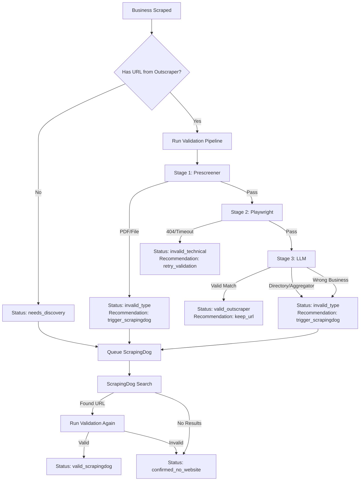

# Website Validation System Improvement Proposal

## Current System Analysis

### Current Validation States
From `models/business.py`:
- `pending` - Not yet validated
- `valid` - Website is real and matches business  
- `invalid` - Website failed to load (technical failure)
- `missing` - No valid website found (directories/aggregators cleared)
- `triple_verified` - ??? (appears in data but not documented)
- `confirmed_missing` - After ScrapingDog also fails
- `error` - Validation process failed

### Current Recommendations (Actions)
From `validation_orchestrator.py`:
- `keep_url` - Valid website, keep it
- `clear_url_and_mark_missing` - Directory/aggregator, clear it
- `mark_invalid_keep_url` - Technical failure, keep for retry

### **CRITICAL PROBLEMS**

#### Problem 1: ScrapingDog Discovery Gap
```python
# Current logic in validation_tasks.py (line 58-70)
if not business.website_url:
    # Trigger ScrapingDog discovery
    discover_missing_websites.delay(str(business_id))
```

**Issue:** ScrapingDog is ONLY triggered if `website_url` is NULL.

**What's missing:**
- If Outscraper provides `http://yelp.com/business` → LLM marks as "missing" → URL is cleared → **ScrapingDog is NOT triggered**
- If Outscraper provides `business.pdf` → Prescreener skips → **ScrapingDog is NOT triggered**

#### Problem 2: No URL Source Tracking
We don't track:
- Where did the URL come from? (Outscraper vs ScrapingDog vs Manual)
- Why was it rejected? (Directory vs PDF vs 404 vs Mismatch)
- Should we try another discovery method?

#### Problem 3: Ambiguous States
- `missing` could mean:
  - "Outscraper gave us a directory (need ScrapingDog)"
  - "ScrapingDog found nothing (truly missing)"
  - "URL was rejected for unknown reason"

#### Problem 4: No Discovery Queue
After clearing a bad URL, we don't have a clear signal that says:
- "This business NEEDS ScrapingDog discovery"
- "WHY it needs discovery"
- "What stage of discovery are we at"

---

## Proposed Improved System

### 1. Enhanced Validation States

```python
# New validation states with clear meaning
VALIDATION_STATES = {
    # Initial States
    "pending": "Not yet validated",
    
    # Success States
    "valid": "Real website found, matches business",
    "valid_outscraper": "Valid from Outscraper (high confidence)",
    "valid_scrapingdog": "Valid from ScrapingDog search",
    
    # Discovery Needed States  
    "needs_discovery": "URL rejected, needs ScrapingDog search",
    "discovery_queued": "ScrapingDog search queued",
    "discovery_in_progress": "ScrapingDog search running",
    
    # Failure States
    "invalid_technical": "Website exists but has technical issues (404, timeout, broken)",
    "invalid_type": "URL is not a website (PDF, directory, aggregator)",
    "confirmed_no_website": "After all discovery methods, no website exists",
    
    # Error States
    "error": "Validation process failed"
}
```

### 2. Add URL Metadata Tracking

```python
# New JSONB field: website_metadata
{
    "source": "outscraper" | "scrapingdog" | "manual" | "backfill",
    "source_timestamp": "2026-02-15T01:00:00Z",
    "validation_history": [
        {
            "timestamp": "2026-02-15T01:00:00Z",
            "url": "https://yelp.com/business/123",
            "verdict": "invalid_type",
            "reason": "Directory/Aggregator - Yelp",
            "recommendation": "trigger_scrapingdog"
        },
        {
            "timestamp": "2026-02-15T01:05:00Z",
            "url": "https://realbusiness.com",
            "verdict": "valid_scrapingdog",
            "reason": "Found via ScrapingDog, matches business",
            "recommendation": "keep_url"
        }
    ],
    "discovery_attempts": {
        "outscraper": {"attempted": true, "found_url": true, "valid": false},
        "scrapingdog": {"attempted": true, "found_url": true, "valid": true},
        "manual": {"attempted": false}
    }
}
```

### 3. Enhanced Recommendations (Actions)

```python
RECOMMENDATIONS = {
    # Keep URL
    "keep_url": "Valid website, no further action",
    
    # Trigger Discovery
    "trigger_scrapingdog": "Clear URL and queue ScrapingDog discovery",
    "retry_validation": "Technical failure, retry validation later",
    
    # Final States
    "mark_no_website": "Confirmed no website exists after all discovery",
    "manual_review": "Uncertain case, needs human review"
}
```

### 4. Improved Validation Flow



### 5. Implementation Changes

#### A. Update Business Model

```python
# backend/models/business.py

# Add new field
website_metadata = Column(JSONB, default=dict, nullable=True)
# Stores source, history, discovery attempts

# Update validation status enum (add to migration)
website_validation_status = Column(
    String(30), 
    default="pending",
    # New values: valid_outscraper, valid_scrapingdog, needs_discovery, 
    #             discovery_queued, discovery_in_progress, invalid_technical,
    #             invalid_type, confirmed_no_website
)
```

#### B. Update Validation Task Logic

```python
# backend/tasks/validation_tasks.py

@shared_task
def validate_business_website(business_id: str):
    with get_db_session_sync() as db:
        business = db.query(Business).filter(Business.id == business_id).first()
        
        # CASE 1: No URL at all
        if not business.website_url:
            business.website_validation_status = "needs_discovery"
            business.website_metadata = {
                "source": "none",
                "discovery_needed_reason": "no_url_from_outscraper"
            }
            # Queue ScrapingDog
            discover_missing_websites.delay(str(business_id))
            return {"status": "discovery_queued"}
        
        # CASE 2: Run validation on existing URL
        result = asyncio.run(_run_validation(...))
        verdict = result.get("verdict")
        recommendation = result.get("recommendation")
        
        # Update status based on recommendation
        if recommendation == "keep_url":
            # Determine source
            source = business.website_metadata.get("source", "outscraper")
            business.website_validation_status = f"valid_{source}"
            
        elif recommendation == "trigger_scrapingdog":
            # Clear bad URL and queue discovery
            logger.info(f"URL rejected: {result.get('reasoning')}")
            
            # Save rejection history
            if not business.website_metadata:
                business.website_metadata = {}
            
            if "validation_history" not in business.website_metadata:
                business.website_metadata["validation_history"] = []
            
            business.website_metadata["validation_history"].append({
                "timestamp": datetime.utcnow().isoformat(),
                "url": business.website_url,
                "verdict": verdict,
                "reason": result.get("reasoning"),
                "recommendation": recommendation
            })
            
            # Clear URL
            business.website_url = None
            business.website_validation_status = "needs_discovery"
            
            # Queue ScrapingDog
            discover_missing_websites.delay(str(business_id))
            return {"status": "discovery_queued"}
            
        elif recommendation == "retry_validation":
            business.website_validation_status = "invalid_technical"
            # Don't clear URL, retry later
```

#### C. Update ScrapingDog Discovery Task

```python
# backend/tasks/discovery_tasks.py

@shared_task
def discover_missing_websites(business_id: str):
    with get_db_session_sync() as db:
        business = db.query(Business).filter(Business.id == business_id).first()
        
        # Mark as in progress
        business.website_validation_status = "discovery_in_progress"
        
        # Run ScrapingDog search
        discovered_url = run_scrapingdog_search(business)
        
        if discovered_url:
            # Found a URL, save it with metadata
            business.website_url = discovered_url
            business.website_metadata = business.website_metadata or {}
            business.website_metadata["source"] = "scrapingdog"
            business.website_metadata["source_timestamp"] = datetime.utcnow().isoformat()
            
            # Queue for validation
            validate_business_website.delay(str(business_id))
        else:
            # No URL found even after ScrapingDog
            business.website_validation_status = "confirmed_no_website"
            business.website_metadata = business.website_metadata or {}
            business.website_metadata["discovery_attempts"] = {
                "outscraper": {"attempted": True, "found_url": bool(business.website_url)},
                "scrapingdog": {"attempted": True, "found_url": False}
            }
```

---

## Benefits of This Approach

### 1. **Clear Decision Points**
- Every state has a specific meaning
- Every recommendation triggers a specific action
- No ambiguity about what to do next

### 2. **Proper ScrapingDog Triggering**
- Triggers when Outscraper provides no URL ✅
- Triggers when Outscraper URL is rejected ✅  
- Triggers when URL is a directory/PDF ✅
- Does NOT trigger when we have a valid website ✅

### 3. **Complete Audit Trail**
- Know exactly where each URL came from
- See full validation history
- Understand why each decision was made
- Track discovery attempts

### 4. **Cost Optimization**
- Don't call ScrapingDog if we have a valid website
- Don't call ScrapingDog multiple times
- Clear distinction between "needs discovery" and "confirmed no website"

### 5. **Better Reporting**
```sql
-- Businesses that need ScrapingDog discovery
SELECT * FROM businesses 
WHERE website_validation_status IN ('needs_discovery', 'discovery_queued');

-- Businesses where Outscraper URL was rejected
SELECT * FROM businesses
WHERE website_metadata->'validation_history' @> '[{"verdict": "invalid_type"}]';

-- Businesses truly without websites (after all discovery)
SELECT * FROM businesses
WHERE website_validation_status = 'confirmed_no_website';

-- Successful ScrapingDog discoveries
SELECT * FROM businesses
WHERE website_validation_status = 'valid_scrapingdog';
```

---

## Migration Plan

### Phase 1: Add New Fields (Migration)
```sql
ALTER TABLE businesses 
ADD COLUMN website_metadata JSONB DEFAULT '{}';

-- Backfill existing data
UPDATE businesses
SET website_metadata = jsonb_build_object(
    'source', CASE 
        WHEN website_url IS NOT NULL THEN 'outscraper'
        ELSE 'none'
    END
)
WHERE website_metadata IS NULL OR website_metadata = '{}';
```

### Phase 2: Update Code
1. Update `validation_orchestrator.py` recommendations
2. Update `validation_tasks.py` to handle new recommendations
3. Update `discovery_tasks.py` to track metadata
4. Update frontend to display new states

### Phase 3: Reprocess "Missing" Businesses
```python
# Script to reprocess businesses marked as "missing" 
# that should have triggered ScrapingDog but didn't
SELECT id FROM businesses
WHERE website_validation_status = 'missing'
  AND website_metadata->>'source' = 'outscraper'
  AND website_url IS NULL;
  
# Update status and queue discovery
UPDATE businesses SET website_validation_status = 'needs_discovery';
# Then queue ScrapingDog tasks
```

---

## Example Scenarios

### Scenario 1: Yelp URL from Outscraper
1. Outscraper: `https://yelp.com/biz/plumbing-911`
2. Validation: LLM says "invalid_type - Directory"
3. Recommendation: `trigger_scrapingdog`
4. Action: Clear URL, status → `needs_discovery`, queue ScrapingDog
5. ScrapingDog: Finds `https://theplumbing911.com`
6. Validation: LLM says "valid_scrapingdog"
7. Final: Status → `valid_scrapingdog`, URL saved ✅

### Scenario 2: PDF from Outscraper  
1. Outscraper: `https://business.com/menu.pdf`
2. Prescreener: "Invalid type - PDF file"
3. Recommendation: `trigger_scrapingdog`
4. Action: Clear URL, status → `needs_discovery`, queue ScrapingDog ✅

### Scenario 3: Valid Website First Try
1. Outscraper: `https://realbusiness.com`
2. Playwright: Extracts phones, emails, content
3. LLM: "valid_outscraper - Perfect match"
4. Recommendation: `keep_url`
5. Final: Status → `valid_outscraper`, no ScrapingDog needed ✅

### Scenario 4: Truly No Website
1. Outscraper: No URL
2. Status → `needs_discovery`, queue ScrapingDog
3. ScrapingDog: No results found
4. Final: Status → `confirmed_no_website`, queue for website generation ✅

---

## Questions to Resolve

1. **Should we distinguish between different types of invalid URLs?**
   - `invalid_type_directory` (Yelp, Yellow Pages)
   - `invalid_type_file` (PDF, ZIP)
   - `invalid_type_social` (Facebook, LinkedIn)
   
2. **How many ScrapingDog attempts before marking as confirmed_no_website?**
   - Proposal: 1 attempt, but allow manual retry

3. **Should we auto-retry technical failures?**
   - Proposal: Yes, with exponential backoff (1h, 6h, 24h)

4. **What about businesses with placeholder/under construction sites?**
   - Proposal: New state `invalid_placeholder`, trigger ScrapingDog

---

## Next Steps

1. **Review this proposal** - Does it cover all scenarios?
2. **Create database migration** - Add `website_metadata` field
3. **Update validation logic** - Implement new recommendations
4. **Update discovery logic** - Implement metadata tracking
5. **Test on subset** - Validate with 50 businesses first
6. **Deploy and monitor** - Watch for issues
7. **Backfill historical data** - Update existing businesses

